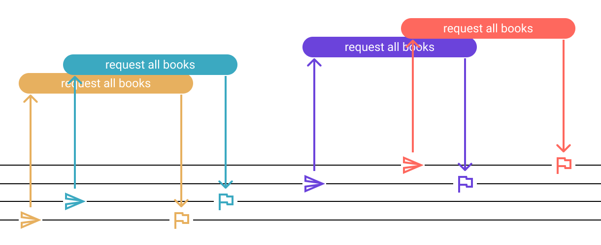
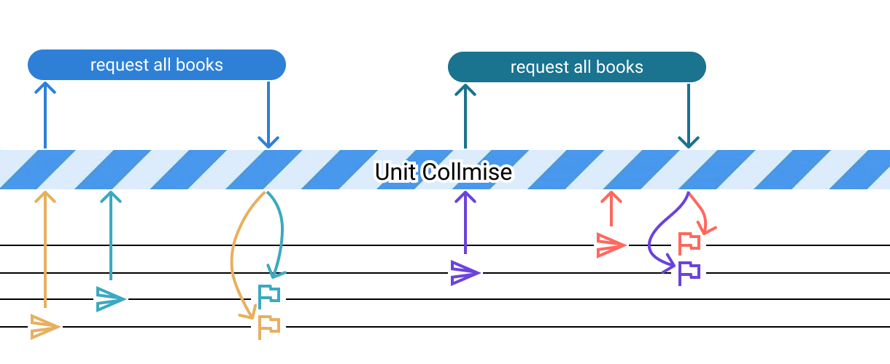
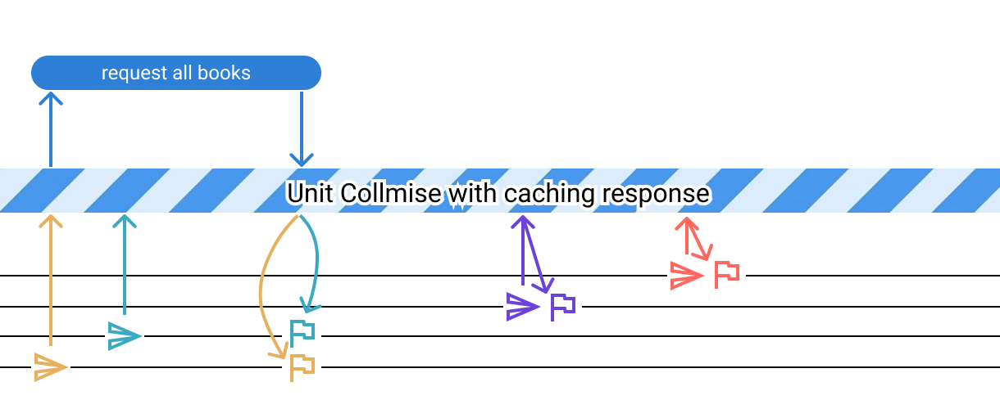

# Collmise - Collect, combine, and cache promises


Collmise provides two main functions - `unitCollmise` and `collmise`;

## unitCollmise

Let's have a function for fetching all the books from the server.

```js
const getAllBooks = () => {
  return fetch("/api/v1.0/books").then(response => response.json())
}
```

In the application, we might need to call `getAllBooks` different times from different places.
The request/response flow might look like this:




We can optimize this flow by combining concurrent requests.
We can achieve this easily using `unitCollmise`

```js
import { unitCollmise } from "collmise";

const allBooksCollmise = unitCollmise();

const getAllBooks = () => {
  return allBooksCollmise.request(() => {
    return fetch("/api/v1.0/books").then(response => response.json())
  });
}
```
In this case, the flow will look like this:



Now let's cache our response for 1 minute. For that we just need to pass options to `unitCollmise`;
```js
const allBooksCollmise = unitCollmise({
  responseCacheTimeoutMS: 60 * 1000
});
```




Sometimes you might want to disable cache and load all data. Let's add an optional parameter for that:

```js
const getAllBooks = (loadFreshData = false) => {
  return allBooksCollmise.fresh(loadFreshData).request(() => {
    return fetch("/api/v1.0/books").then(response => response.json())
  });
}
```

### **Note for typescript users**
You can add types either by passing type to unitCollmise generic like this:
```ts
const allBooksCollmise = unitCollmise<Books[]>();
```
or by using `requestAs` method instead of `request`:
```ts
const getAllBooks = () => {
  return allBooksCollmise.requestAs((): Promise<Books[]> => {
    return fetch("/api/v1.0/books").then(response => response.json())
  });
}
```
In both cases getAllBooks will have return type `Promise<Books[]>`