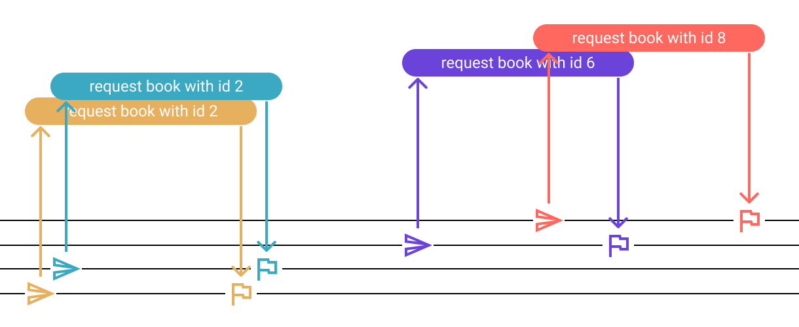
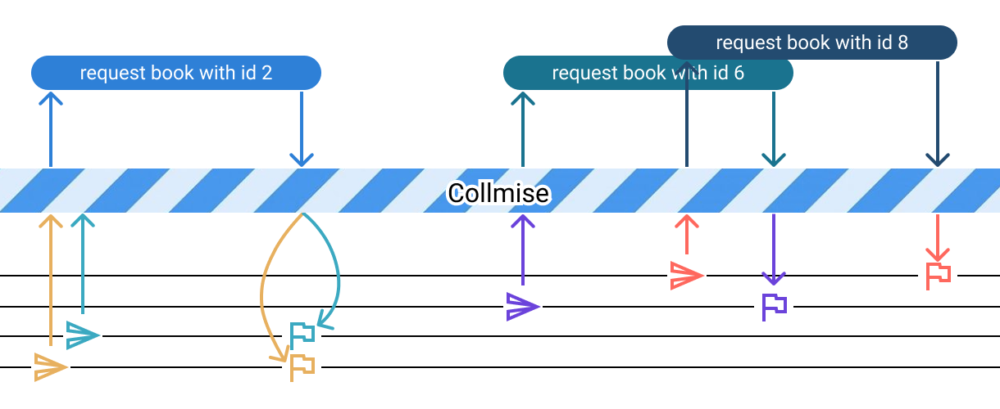
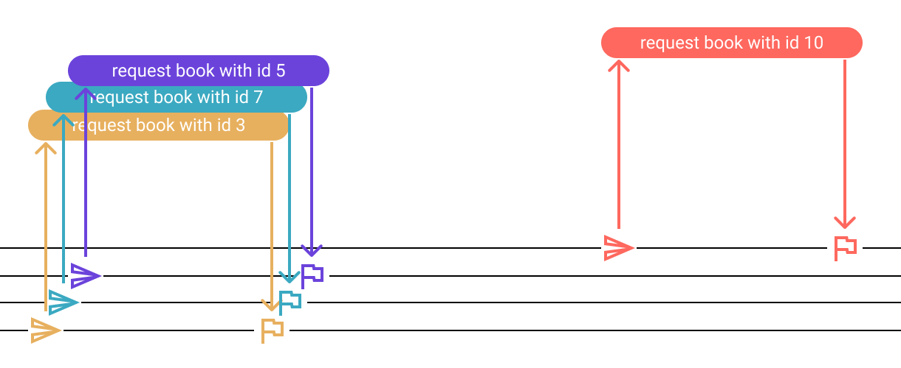
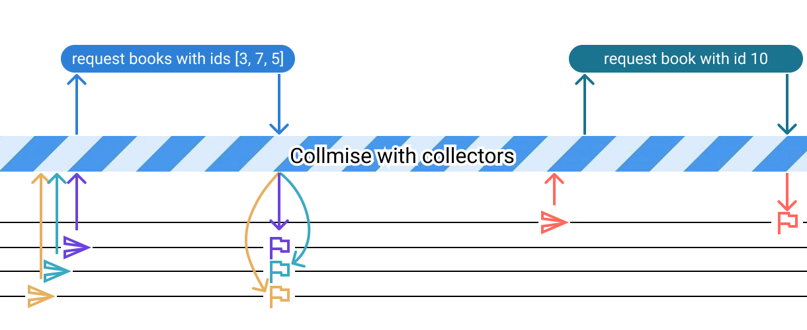

# Collmise - Collect, combine, and cache promises


Collmise provides two main functions - `unitCollmise` and `collmise`;

## unitCollmise

Let's have a function for fetching all the books from the server.

```js
const getAllBooks = () => {
  return fetch("/api/v1.0/books").then(response => response.json())
}
```

In the application, we might need to call `getAllBooks` different times from different places.
The request/response flow might look like this:


We can optimize this flow by combining concurrent requests.
We can achieve this easily using `unitCollmise`

```js
import { unitCollmise } from "collmise";

const allBooksCollmise = unitCollmise();

const getAllBooks = () => {
  return allBooksCollmise.request(() => {
    return fetch("/api/v1.0/books").then(response => response.json())
  });
}
```
In this case, the flow will look like this:


Now let's cache our response for 1 minute. For that we just need to pass options to `unitCollmise`;
```js
const allBooksCollmise = unitCollmise({
  responseCacheTimeoutMS: 60 * 1000
});
```


Sometimes you might want to disable cache and load all data. Let's add an optional parameter for that:

```js
const getAllBooks = (loadFreshData = false) => {
  return allBooksCollmise.fresh(loadFreshData).request(() => {
    return fetch("/api/v1.0/books").then(response => response.json())
  });
}
```

### **Note for typescript users**
You can add types either by passing type to unitCollmise generic like this:
```ts
const allBooksCollmise = unitCollmise<Books[]>();
```
or by using `requestAs` method instead of `request`:
```ts
const getAllBooks = () => {
  return allBooksCollmise.requestAs((): Promise<Books[]> => {
    return fetch("/api/v1.0/books").then(response => response.json())
  });
}
```
In both cases getAllBooks will have the return type `Promise<Books[]>`

### collmise

While `unitCollmise` might be good for fetching the same data, it won't be much of an use when we want to fetch data with different identifications.

Let's have a function `getBookById` like this:


```js
const getBookById = (bookId) => {
  return fetch(`/api/v1.0/books/${bookId}`).then(response => response.json())
}
```

The request/response flow will look like this:



now if we use `collmise` function like this:
```js
import { collmise } from "collmise";

const booksCollmise = collmise();

const getBookById = (bookId) => {
  return booksCollmise.on(bookId).request(() => {
    return fetch(`/api/v1.0/books/${bookId}`).then(response => response.json())
  });
}
```

our flow graph will look like this:



<br/><br/>

### **Note for typescript users**
You can add types either by passing type to collmise generic like this:
```ts
const booksCollmise = collmise<number, Books>();
```
Where first type is the type of identification and the second is the type of data.
Alternatively you can use `requestAs` method instead of `request` the same way as in `unitCollmise`

<br/>
<br/>
<br/>

You can cache response the same way as in `unitCollmise`

<br />
And that's not the greatest magic of collmise!
<br/>
<br/>

Let's have a function for fetching multiple books by ids.

```js
const getManyBooksByIds = (bookIds) => {
  return fetch(`/api/v1.0/books?ids=${bookIds.join()}`).then(response => response.json())
}
```

Let's say that our flow looks like this:



Of course, we can optimize this flow using `getManyBooksByIds` method, but it will require us to optimize such cases one-by-one. And it soon becomes a burden if fetching one-by-one is spread across the application.

Let's use collmise and it's main magic - collectors.


```js

const booksCollmise = collmise({
  collectingTimeoutMS: 15, // wait max 15 milliseconds for a single request to be collected by a collector 
}).addCollector({
  name: "manyByIds", // name it as you wish
  findOne: (bookId, books) => books.find(book => book.id === bookId), // find one book from response
  onRequest: (bookIds) => fetch(`/api/v1.0/books?ids=${bookIds.join()}`).then(response => response.json())
});

const getBookById = (bookId, loadFresh = false) => {
  // we can use `fresh` method here too
  return booksCollmise.on(bookId).fresh(loadFresh).request(() => {
    return fetch(`/api/v1.0/books/${bookId}`).then(response => response.json())
  });
}

```

The flow becomes like this 🔮


Our promises are collected and combined! 🌌

<br />

<br />

If you no longer wish to support sending individual requests at all, we can implement `getBookById` this way:
```js
const getBookById = (bookId) => {
  return booksCollmise.on(bookId).submitToCollectors();
}
```


For advanced use cases please see the rest of the documentation [here.](https://github.com/thomasmikava/collmise/blob/master/API.md)
